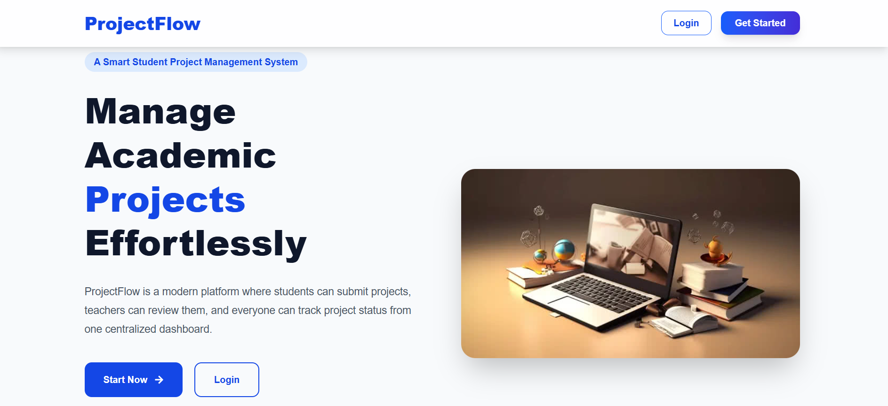
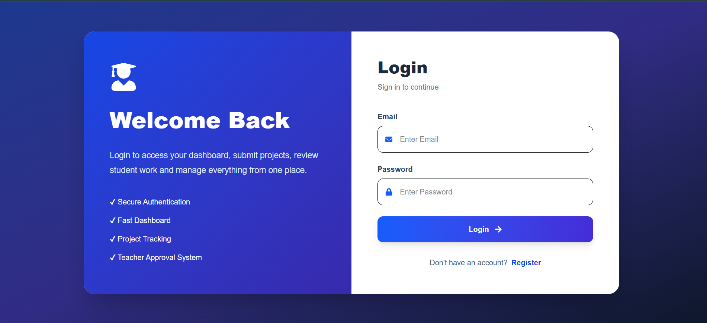
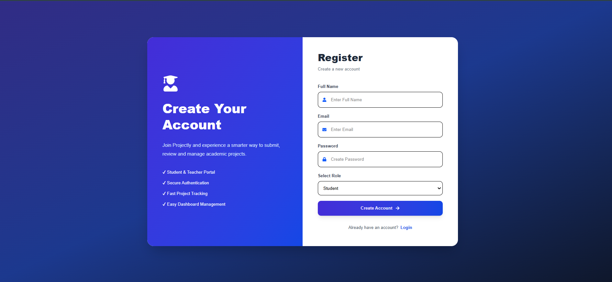
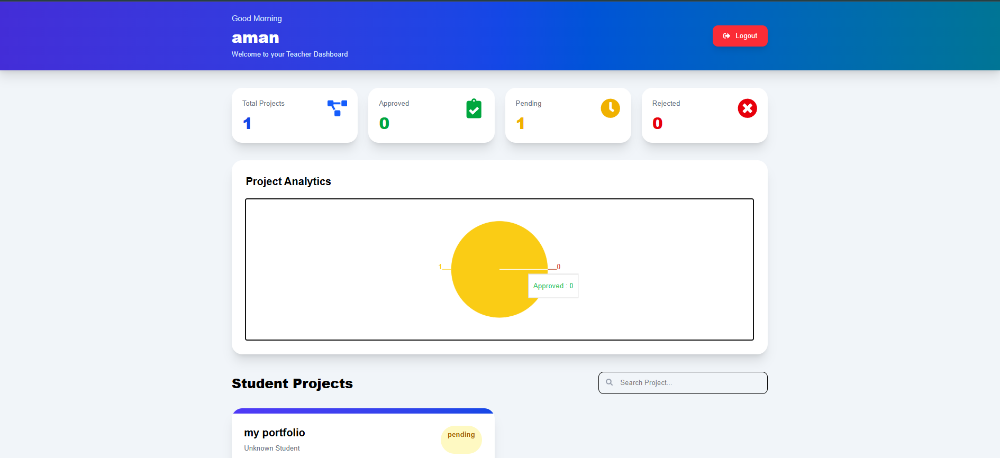

# 🚀 ProjectFlow

A Full-Stack Project Management System built using the MERN Stack.

### Tech Stack

`MERN` `React` `Node.js` `Express.js` `MongoDB` `JWT` `Axios` `Tailwind CSS` `Cloudinary` `Vercel` `Render` `Git` `GitHub`

---

## 🌐 Live Demo

**Frontend:** https://project-flow-cyan-psi.vercel.app/

**Backend:** https://projectflow-y7fs.onrender.com/

---

## 📸 Screenshots

### Home Page

### Login Page

### Register Page

### Teacher Dashboard

---

## ✨ Features

- User Authentication & Authorization
- JWT-based Login System
- Student Dashboard
- Teacher Dashboard
- Project Submission Workflow
- Project Approval & Rejection
- File Upload Integration
- Cloudinary Storage
- Responsive UI
- MongoDB Atlas Integration

---

## 🛠️ Architecture

Frontend (React + Vite)
↓
Backend API (Node.js + Express)
↓
MongoDB Atlas
↓
Cloudinary Storage

---

## 📚 What I Learned

- Building REST APIs with Express.js
- MongoDB Database Design using Mongoose
- JWT Authentication
- React Routing and State Management
- Frontend-Backend Integration using Axios
- File Upload Handling with Multer
- Cloud Deployment using Vercel and Render
- Git & GitHub Workflow

---

## 👨‍💻 Author

**Shivanshi Yadav**

GitHub: https://github.com/shivanshiyadav2004
